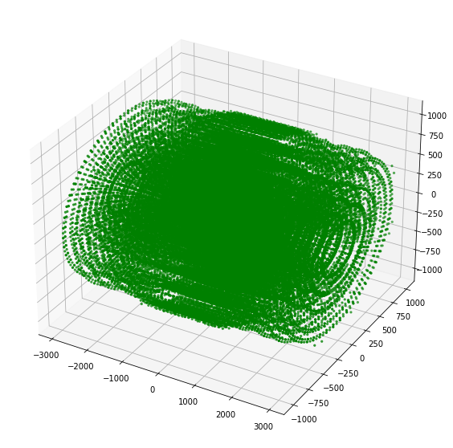
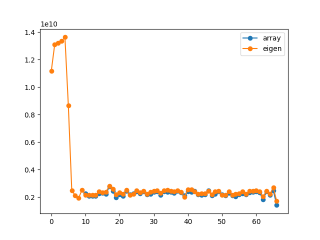
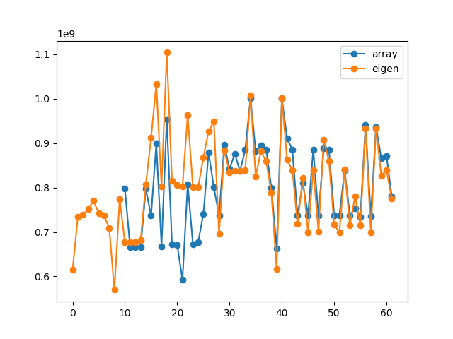
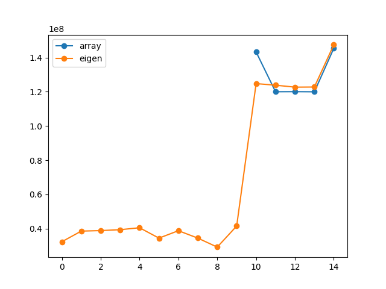
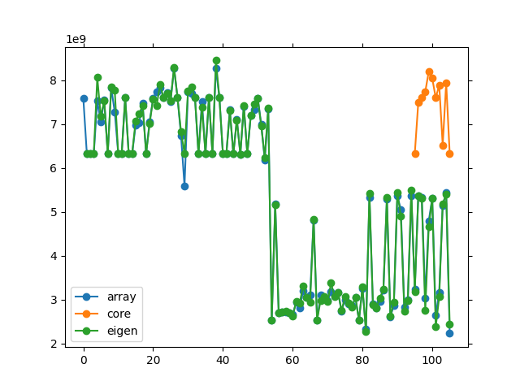
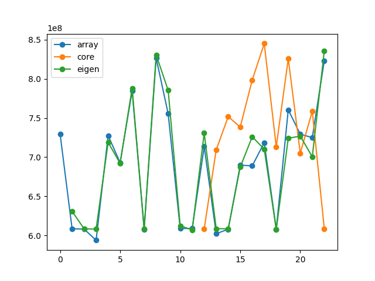
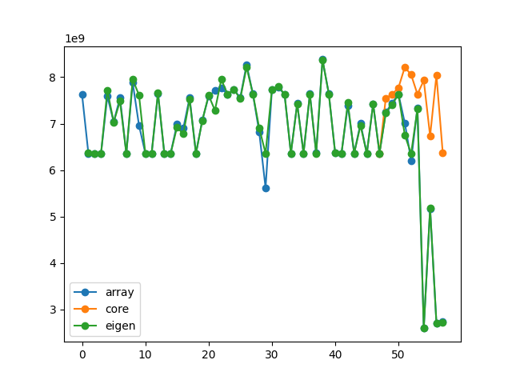
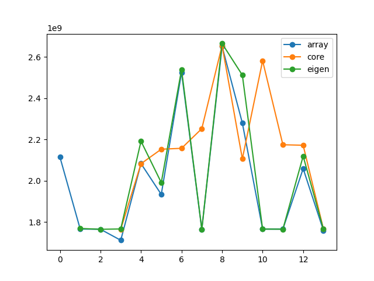

## benchmark monitoring 

### intersection benchmarks

The following benchmarks test the surface intersections, the x-axis are commits in time, so want to see a negative gradient.

#### This tests shows the intersections with all sensitive surfaces of the TrackML detector:

It performs 10000 tracks with each track trying to intersect all surfaces int he TrackML detector without preselection.

#### This tests shows the intersection with concentric cylinders
Cylinders are positioned at (0,0,0) and not rotated wrt the global frame

#### This tests shows the intersection with arbitrary cylinders

#### This tests shows the intersection with planar surfaces

### mask benchmarks

The following benchmarks test the application of masks on already on-surface intersections.

